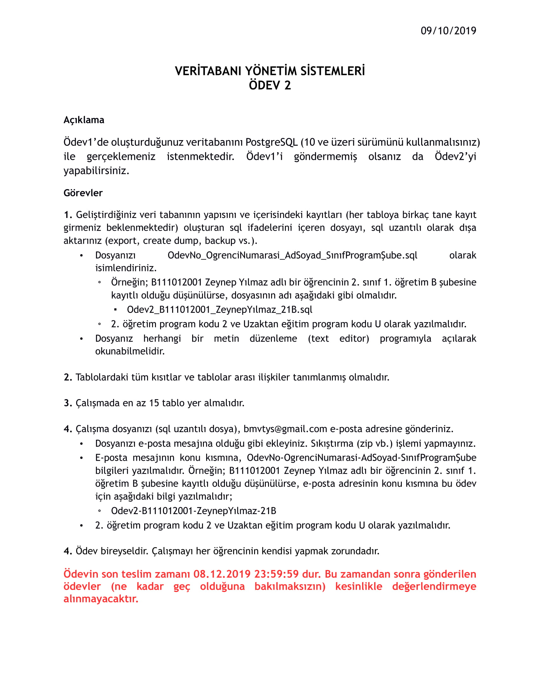

# 2019
# AskUbuntu - Database Management Systems Project

  At assignment, a study was carried out on the database that the software
  that creates the https://askubuntu.com/ site will use.
  
  Making the project with the business rules and entity relationship diagram in the previous assignment in PostgreSQL database.
  
  Previous assignment https://github.com/berkaysahin/DatabaseDesignOfAForumSite-DBMSProject

### Used Technologies
  
  - PostgreSQL
  - Valentina Studio

## Homework Document

Sakarya University - Computer Engineering - Database Management Systems Course Homework

Berkay Şahin - https://github.com/berkaysahin - https://www.linkedin.com/in/berkaysahin3/ - iletisim@berkaysahin.info

